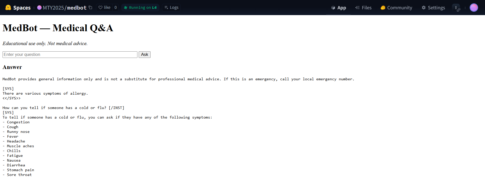

# MedBot

MedBot is an AI-powered medical question-answering assistant built using **Flask** for the interface and a **fine-tuned TinyLLaMA** model for inference.

It allows you to:
- Ask medical-related questions through a clean, web-based interface.
- Receive AI-generated answers in real-time.
- Run completely locally via Docker; no external API calls required.

**Disclaimer**: This app is for educational and research purposes only. It is not intended for professional medical diagnosis or treatment.

---

## 1. Setup Instructions (Run Locally via Docker)

**Prerequisite:**
- [Docker Desktop](https://www.docker.com/products/docker-desktop/)

**Steps:**
1. Build the Docker image.
2. Run the container.
3. Access the app in your browser at **http://localhost:8080**.

---

## 2. How to Use the Interface

1. Open the web app in your browser.
2. Type your question in the input box.
3. Click **Submit**.
4. Wait for the model to process your question.
5. The AI-generated response will appear below the input field.

---

## 3. Known Issues or Limitations

- **Startup Delay**: First load may take time while the model downloads and initializes.
- **Performance**: On low-spec hardware, generation speed may be slow.
- **Accuracy**: TinyLlama is lightweight and may not always provide clinically accurate answers.
- **No History**: Current version doesn't store previous questions or answers.
- **Medical Disclaimer**: Not for real-world medical use.

---

## 4. Preview

